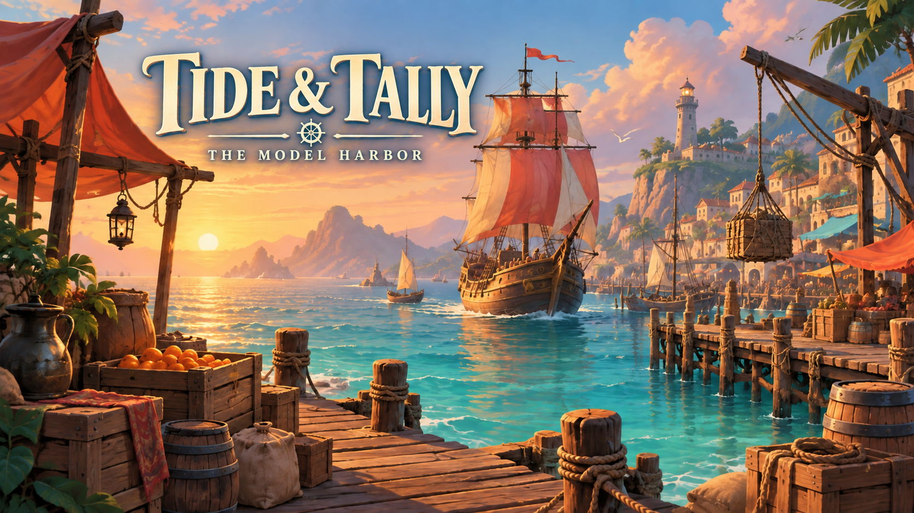

# Tide & Tally: The Model Harbor

Tide & Tally is a small, dependency-free browser merchant trading game and an open benchmark for testing how local AI coding models build software over time.

*A fair harbor for testing how AI models build software.*



Tide & Tally combines a classic buy-low, sell-high sailing loop with a reproducible local-LLM coding experiment. Models receive the same game, requirements, prompts, time budget, and checks, so future runs can be compared fairly.

## The game

Tide & Tally is an original, dependency-free browser game inspired by the merchant-sailing loop of classic Tradewinds-style games:

- Sail between a small set of ports.
- Buy goods where they are cheap and sell them where they are scarce.
- Manage cash, cargo capacity, travel time, and risk.
- Upgrade the ship after earning enough profit.
- Respond to occasional sea events.

The game is intentionally small, deterministic, and easy to test. It does not copy Tradewinds’ assets, characters, dialogue, story, or interface. The benchmark measures implementation quality, not artistic imitation.

## How to play

Start with 600 gold and a six-unit cargo hold. Visit the five ports, buy goods where prices are low, sail to better markets, and build enough profit to reach 2,000 gold before the 24-turn voyage ends. Ship upgrades increase capacity and create another decision point.

The harbor artwork above is original concept art for the game world; the playable interface is rendered in HTML, CSS, and JavaScript.

## Hardware target

- MacBook Pro with Apple M1 Pro
- 16 GB unified memory
- External Samsung T9 with approximately 1.7 TB free space
- macOS

The initial test should use the smallest Colibrì-compatible model that fits comfortably. GLM-5.3 itself is an optional stress test: storage is available, but 16 GB unified memory is the limiting constraint.

## Benchmark objective

Each model receives the same repository, requirements, prompts, time budget, and test commands. The model is evaluated on whether it can:

1. Explain the existing codebase accurately.
2. Implement a requested feature across at least two files.
3. Run the smoke tests and browser game locally.
4. Diagnose and fix at least one intentionally introduced bug.
5. Produce a clean Git diff and a short implementation summary.

See [PROJECT_BRIEF.md](PROJECT_BRIEF.md), [GAME_SCOPE.md](GAME_SCOPE.md), [AGENT_WORKFLOW.md](AGENT_WORKFLOW.md), and [BENCHMARK.md](BENCHMARK.md) for the controlled plan.

For the machine-specific model experiment, see [COLIBRI_RUN_PLAN.md](COLIBRI_RUN_PLAN.md). For publication, see [PUBLISH.md](PUBLISH.md).

## Run the game

Open `index.html` in a browser. No package installation is required.

For a local HTTP server:

```bash
python3 -m http.server 8080
```

Then open <http://127.0.0.1:8080>.

## Run checks

```bash
./tests/smoke.sh
```

## Repository status

The public repository is <https://github.com/codeDEXTER/tide-and-tally>. The local POC folder is `tide-and-tally-poc`.

## Search terms

Browser trading game · merchant sailing game · dependency-free JavaScript game · local AI coding benchmark · GLM-5.3-Flash · Colibrì · incremental software development · model evaluation

## License

The source code and original project materials are available under the [MIT License](LICENSE). The GLM-5.3-Flash model, Colibrì runtime, and any third-party components remain under their own licenses.

## Author

Created by **Aashish Sud (codeDEXTER)**.

## Attribution rule

Any external code, art, data, documentation, design reference, or model-generated material used in a contribution must be identified and credited with its source and license. The benchmark treats uncredited reuse as a failure; the game remains original and does not use protected Tradewinds assets or content.
